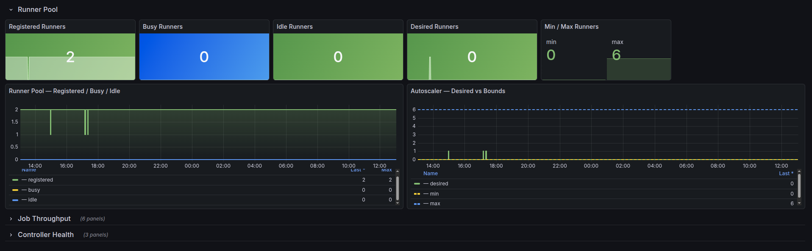
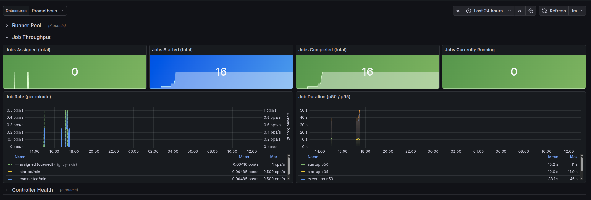
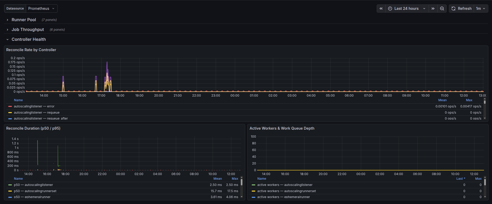

# GitHub Actions ARC - Runner Scale Set

Monitors the GitHub Actions Runner Scale Set Controller (ARC) running on Kubernetes.

**Grafana.com:** https://grafana.com/grafana/dashboards/25015-github-actions-arc-runner-scale-set/

## Screenshots

## Requirements

| Dependency | Version |
|------------|---------|
| Grafana    | 10.0+   |
| Prometheus | any     |

## Usage

Import `dashboard.json` via Grafana UI (**Dashboards → Import**) or place it in your
provisioning directory (`/etc/grafana/provisioning/dashboards/`).
